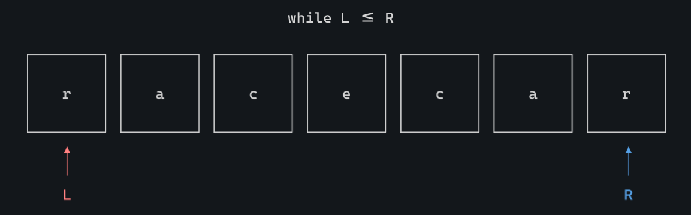
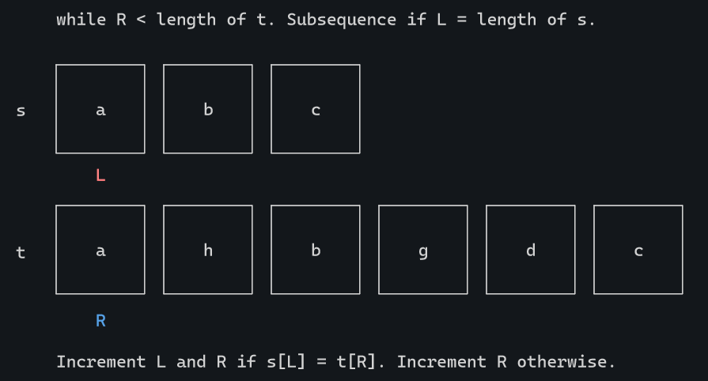
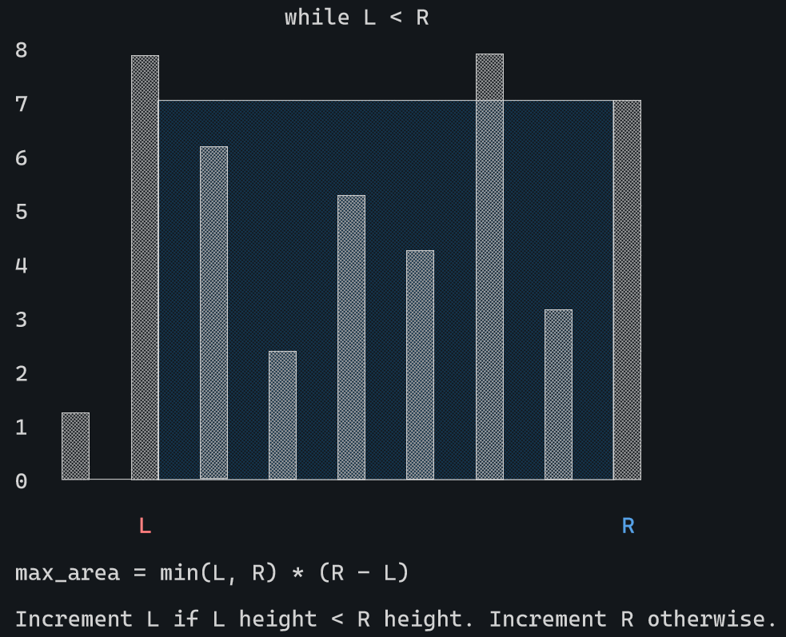
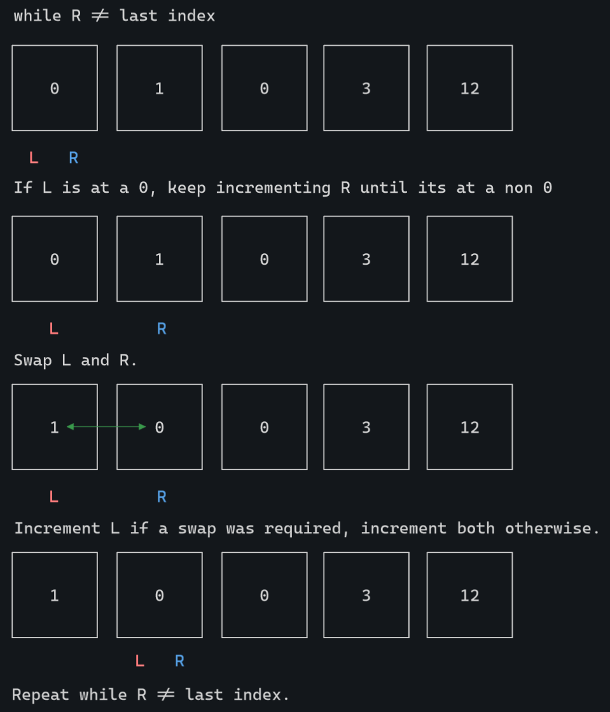

# Two-Pointer Coding Pattern
The two pointer technique is a programming technique used to efficiently solve problems by using two pointers or references, typically iterating over elements in an array or sequence. The technique involves initializing two pointers at different positions of the array and then manipulating the pointers based on the problem's requirements (moving them closer together or farther apart) to solve the problem in $O(n)$ linear time with minimal additional space.

## When to Use
This pattern is useful for both sorted and unsored collections of values where you might need to search through all possibilities using only constant extra space.

### Finding a Pair Sum
When given a **sorted** array and asked to find a pair of elements that sum up to a target value, using the two pointer technique can be efficient. By initializing one pointer at the beginning of the array and another at the end, you can adjust the pointers inward based on whether the current sum is too small or too large.


This approach could be used in the Leetcode problem [Two Sum II - Input Array Is Sorted](https://leetcode.com/problems/two-sum-ii-input-array-is-sorted/description/). It works because the input array is already sorted allowing us to apply the algorithm that uses only constant extra space to find the indexes that sum to reach our target.

#### Sample Code
This is how you might implement this algorithm. Left starts at the first index and right starts at the last index. The algorithm runs until the target value is found or both pointers meet at the same index.
```go
// nums = [2, 7, 11, 15]

left := 0
right := len(nums) - 1

for left < right {
    if nums[left] + nums[right] > target {
        right--
    } else if nums[left] + nums[right] < target {
        left++
    } else {
        // found the target!
    }
}
```

### Checking for Palindromes
To determine if a string or array is a palindrome (meaning it reads the same forwards and backwards), you can use the two pointer approach. One pointer starts at the beginning and the other at the end, and they move towards the center, comparing elements at each step.



You could use this approach in the Leetcode problem [Valid Palindrome](https://leetcode.com/problems/valid-palindrome/description/) where you must determine if a string is a palindrome or not. Once the string filtering has been completed, you can iterate over the remaining characters with the two pointer algorithm. If at any point the character at left pointer is not the same as the character at right pointer, the string is not a palindrome.

#### Sample Code
Here, the loop breaks when left passes by right. Left and right reached the same character without any differences which means our string was in fact a palindrome.

```go
// s = "racecar"

left := 0
right := len(s) - 1

for {
    if left > right {
        // palindrome!
    }

    if s[left] != s[right] {
        // not a palindrome!
    }

    left++
    right--
}
```

### Finding a Subsequence
If you're given two input arrays `s` and `t` and the goal is to find if one array is a subsequence of the other, you can use the two pointer pattern to interate through both arrays at one time. 

The left pointer is advanced when a matching character at right pointer is found. If left pointer interates through the entire `s` string then the string is a subsequence of `t`. If the right pointer iterates through `t` before left pointer iterates through `s`, the string is not a sub sequence. This describes the one of the Leetcode solutions to [Is Subsequence](https://leetcode.com/problems/is-subsequence/description/), a problem where the programmer must determine if one string is a subsequence of another.



#### Sample Code
The loop continues while there are still characters in `t` to iterate through. If we complete the iteration through `s` we have found the substring.

```go
// s = "abc"
// s = "ahbgdc"

left := 0
right := 0

for right < len(t) {
    if s[left] == t[right] {
        left++

        if left == len(s) {
            // found the subsequence!
        }
    }
    right++
}

// didn't find the subsequence!
```

### Finding the Max Area in a Graph
Input in this scenario might not be sorted but you're asked to check for the maximum area of a rectangle in a given space (histogram). The approach is similar to looking for a pair sum in a sorted array except you will need to iterate over all possibilities. The problem described here is the Leetcode problem [Container With Most Water](https://leetcode.com/problems/container-with-most-water/description/) and can be solved similarly to Finding a Pair Sum where you must decide if the left pointer must be incremented or right pointer must be decremented.



### Moving Zeros to the End
In this situation you're being asked to modify an array in place (no copies), where the end result should have all target values (zeros in this case) moved to the end. This is possible with a two pointer approach where the right pointer iterates ahead of the left pointer to find the next non-target value to swap with. The approach is basically kicking the zeros down as far as you can in the array until theres no more non-zeros to swap with.



This describes the Leetcode problem [Move Zeroes](https://leetcode.com/problems/move-zeroes/description/) where you must move the zeroes to the end of the array without making a copy of the array.

#### Sample Code
Continue pushing the zeroes to the end of the array while right pointer has not interated through `nums`.

```go
left := 0
right := 0

for right != (len(nums) - 1) {
    if left < len(nums) && nums[left] == 0 {
        for right != (len(nums)-1) && nums[right] == 0 {
            right++
        }

        // do the swap!

        left++
    } else {
        left++
        right++
    }
}
```