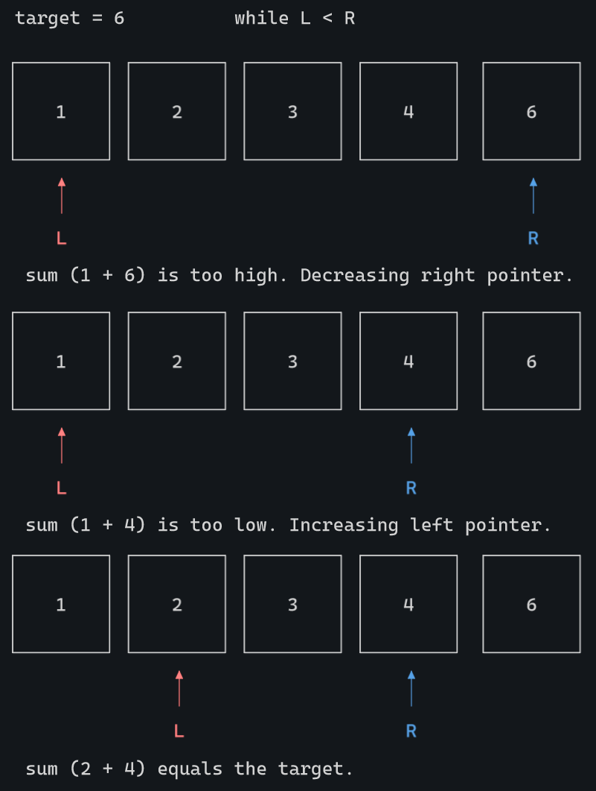

# Two-Pointer Coding Pattern
The two pointer technique is a programming technique used to efficiently solve problems by using two pointers or references, typically iterating over elements in an array or sequence. The technique involves initializing two pointers at different positions of the array and then manipulating the pointers based on the problem's requirements (e.g., moving them closer together or farther apart) to solve the problem in linear time complexity O(n) with minimal additional space.

## When to Use
This is a helpful pattern when the input array is **sorted** but can also be useful if you need to iterate through all possibilities of an array for a max or min value.

### Finding a Pair Sum
When given a sorted array and asked to find a pair of elements that sum up to a target value, using the two pointer technique can be efficient. By initializing one pointer at the beginning of the array and another at the end, you can adjust the pointers inward based on whether the current sum is too small or too large.

### Checking for Palindromes
To determine if a string or array is a palindrome (reads the same forwards and backwards), you can use the two pointer approach. One pointer starts at the beginning and the other at the end, and they move towards the center, comparing elements at each step.

### Finding a Subsequence
If you're given two input arrays s and t and the goal is to find if one array is a subsequence of the other, you can use the two pointer pattern to interate through both arrays at one time. If the left pointer is equal to the length of the s string, you have found the substring. If the right pointer is equal to the length of the t string, you have checked all indexes of t for the matching character with no success, s is not a substring.

### Finding the Max Area in a Graph
Input in this scenario might not be sorted but you're asked to check for the maximum area of a rectangle in a given space (histogram). The approach is similar to looking for a pair sum in a sorted array except you will need to iterate over all possibilities.

### Moving Zeros to the End
In this situation you're being asked to modify an array in place (no copies), where the end result should have all target values (zeros in this case) moved to the end. This is possible with a two pointer approach where the right pointer iterates ahead of the left pointer to find the next non-target value to swap with. The approach is basically kicking the zeros down as far as you can in the array until theres no more non-zeros to swap with.

